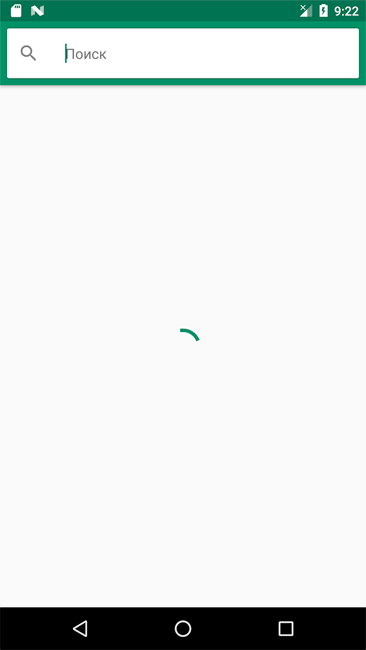
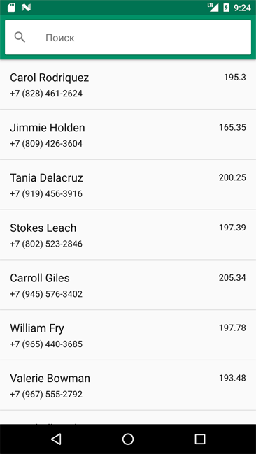
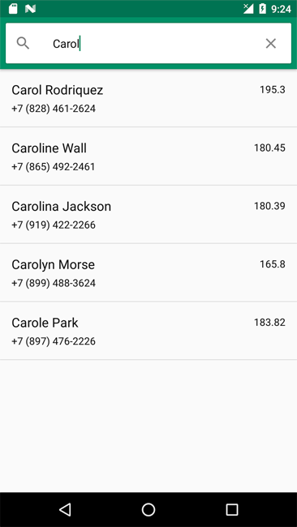
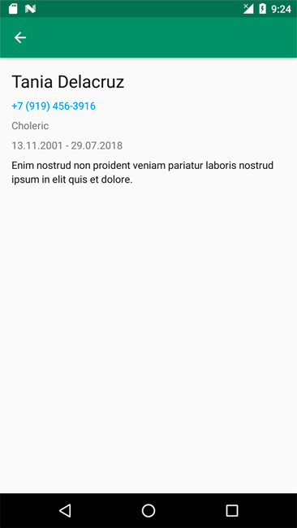

# Тестовое задание на Xamarin-разработчика в Контур.Эльбу

Написать мобильное приложение, которое отображает список контактов и выполняет поиск по ним. Приложение должно быть написано на Xamarin. Приложение должно работать как минимум на одной из двух платформ (iOS, Android) и должно быть спроектировано так, чтобы можно было добавить вторую платформу с минимальной доработкой уже написанного кода. Можно использовать как Xamarin.Forms, так и нативную вёрстку. Решенное задание выложить на github/gitlab.

## Задача

Приложение получает данные из трех источников: [источник1](json/generated-01.json), [источник2](json/generated-02.json), [источник3](json/generated-03.json) и сохраняет их локально, в БД. Приложение должно скачивать данные именно из данного репозитория на github. _Для получения прямой ссылки на json нажать View Raw при просмотре._

В процессе загрузки контактов на экране отображается круговой ProgressBar или ActivityIndicator.

Полученные данные отображает и позволяет выполнять поиск по ним. При клике на контакт открывается экран с подробной информацией.

Контакт имеет следующий вид
- id (string) — ID контакта
- name (string) — Имя человека
- phone (string) - Номер телефона человека
- height (float) — Рост человека
- biography (string) — Биография человека
- temperament (enum) — Темперамент человека (melancholic, phlegmatic, sanguine, choleric)
- educationPeriod (object) — Период прохождения учебы. Состоит из дат start и end.

## Важные моменты

1. Список контактов можно обновить с помощью pull-to-refresh.
2. Сортировать список по имени в алфавитном порядке.
3. Поиск среди контактов происходит по имени или номеру телефона с любым форматом (4622257 должен найти Macdonald Talley).
4. Результаты поиска появляются по мере ввода символов в строку поиска и могут отображаться в основном списке.
5. Клик по номеру телефона запускает звонок.
6. Если при запуске приложения с момента прошлой загрузки данных прошло __более 1 минуты__, то данные необходимо загрузить заново. Иначе нужно показать данные, сохраненные локально.
7. Если при загрузке или обновлении данных происходит ошибка, то нужно показать сообщить о ней пользователю. В случае ошибки скачивания новых данных - старые данные должны остаться в базе.
